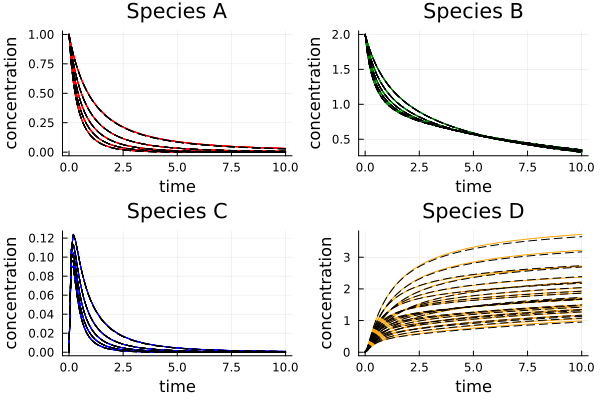
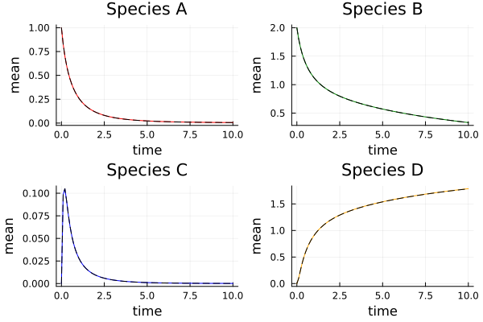
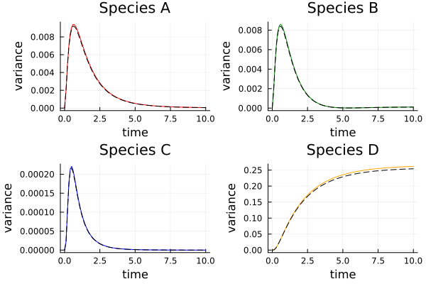

# Polynomial Chaos Expansion for Random ODEs
## Sketch of the Theory
This section reviews the basic concept behind the use of Polynomial Chaos Expansion (PCE) for approximate solution to random ODEs as well as how `ModelOrderReduction` facilitates its use within the SciML ecosystem.

In essence, PCE is nothing more than a function expansion technique for square integrable functions where the basis functions are chosen to be orthogonal polynomials; for a detailed treatment of the mathematical underpinnings the interested reader is referred to Gautschi (2004) [1], for example. For the sake of this tutorial we will remain much more informal and discuss only aspects that are critical for basic use of PCE in computational practice. To that end, we will consider the problem of finding a parametric solution to the following *random* ODE:
```math
\begin{aligned}
    \frac{dx}{dt}(p) = f(x,p,t), \quad x(0) = x_0(p)
\end{aligned}
```
where the parameters $p$ are *apriori* only known to follow a given distribution $\mu$. Specifically, we will seek to find an approximation to the solution $x(t,p)$ in the form of a PCE that matches the statistics of the random process $x(t,p)$ with $p \sim \mu$. To that end, we approximate 
```math
\begin{aligned}
    x(t,p) \approx \hat{x}(t,p) = \sum_{i=0}^L z_i(t) \zeta_i(p)
\end{aligned}
```
where $\zeta_0(p), \dots, \zeta_L(p)$ are mutually orthogonal polynomial with respect to the distribution $\mu$, i.e.,
```math
\begin{aligned}
    \left\langle \zeta_i, \zeta_j \right\rangle := \int \zeta_i(p) \zeta_j(p) d\mu(p) = \delta_{ij}
\end{aligned}
```
where $\delta_{ij}$ is the Kronecker delta. These polynomials can be efficiently constructed for many distributions. In particular, they are known analytically for many standard distributions including but not limited to Gaussians, uniform or beta distributions; moreover, they can be approximated numerically for distributions with known smooth densities and even empirically known distributions. For more details, please review the documentation of [PolyChaos.jl](github.com/SciML/PolyChaos.jl) or Gautschi (2004) [1] for instance.

Inserting the PCE-Ansatz $\hat{x}$ into the random ODE of interest yields 
```math
\begin{aligned}
    \sum_{i=0}^L \frac{dz_i}{dt}(t) \zeta_i(p) = f\left(\sum_{i=0}^L z_i(t) \zeta_i(p), p, t \right),  \sum_{i=0}^L z_i(0) \zeta_i(p)
\end{aligned}
```
To derive evolution equations for the coefficients (or *moments*) $z_i$ we simply demand that the residual of the above equations to be orthogonal to the space spanned by $\zeta_0, \dots, \zeta_L$. Orthogonality here shall be understood with respect to the inner product as described above. This is equivalent to demanding minimal expected mismatch when evaluating the above equation for $p \sim \mu$. Mathematically, this condition translates into a set of deterministic ODEs for the moments $z_j$:
```math
\begin{aligned}
    \left\langle\sum_{i=0}^L \frac{dz_i}{dt}(t) \zeta_i(p), \zeta_j(p) \right\rangle = \left \langle f\left(\sum_{i=0}^L z_i(t) \zeta_i(p), p, t \right),  \sum_{i=0}^L z_i(0) \zeta_i(p), \zeta_j(p) \right\rangle
\end{aligned}
```
and since $\left\langle \zeta_i, \zeta_j\right\rangle = \delta_{ij}$ it follows that
```math
\begin{aligned}
    \frac{dz_0}{dt} &= \left \langle f\left(\sum_{i=0}^L z_i(t) \zeta_i(p), p, t \right),  \sum_{i=0}^L z_i(0) \zeta_i(p), \zeta_0(p) \right\rangle\\
    & \vdots\\
    \frac{dz_L}{dt} &= \left \langle f\left(\sum_{i=0}^L z_i(t) \zeta_i(p), p, t \right),  \sum_{i=0}^L z_i(0) \zeta_i(p), \zeta_L(p) \right\rangle
\end{aligned}
```
with initial condition
```math
\begin{aligned}
    z_i(0) = \left\langle x_0, \zeta_i \right\rangle. 
\end{aligned}
```
These equations are referred to as the moment equations and can in principle be solved with any suitable IVP solution technique. 

## Example
In this section, we will showcase how `ModelOrderReduction.jl` may be used to apply PCE for the approximate solution of random ODEs as described in the previous section. To that end, we will consider a simple nonlinear reactor in which the following reaction occurs
```math
\begin{aligned}
    &A + B \xleftrightharpoons[k_1(1-\frac{\theta_1}{2})]{k_2} C\\
    &C \xrightarrow{k_3(1-\frac{\theta_2}{2})} D\\
    &B \xrightarrow{k_4} D
\end{aligned}
```
where the rate parameters $\theta_1 \sim U[-1,1]$, $\theta_2 \sim U[-1,1]$ are uncertain. Using [ModelingToolkit.jl]{github.com/SciML/ModelingToolkit.jl} the following code creates the associated model.
```
using ModelOrderReduction, ModelingToolkit, DifferentialEquations, PolyChaos, Plots

@parameters k[1:4], θ[1:2]
@variables t, c(t)[1:4]
D = Differential(t)
reactor = [D(c[1]) ~ -k[1]*(1+0.5*θ[1])*c[1]*c[2] + k[2]*c[3];
           D(c[2]) ~ -k[1]*(1+0.5*θ[1])*c[1]*c[2] - k[4]*c[2] + k[2]*c[3];
           D(c[3]) ~ k[1]*c[1]*c[2] - k[3]*c[3];
           D(c[4]) ~ k[3]*(1+0.5*θ[2])*c[3] + k[4]*c[2]];

@named reactor_model = ODESystem(reactor, t, c, vcat(k, θ))
```

Next, we are going to define the PCE Ansatz with the help of which we are going to approximate the parametric solution. To that end, we heavily rely on [PolyChaos.jl]{github.com/SciML/PolyChaos.jl}. In this example, we choose a PCE of degree 3. 
```
d_pce = 3
pce = PCE(c, [θ[i] => Uniform_11OrthoPoly(d_pce) for i in eachindex(θ)])
```

Next, we are constructing the corresponding moment equations via a simple function call of `moment_equations`. This function returns an `MTK.ODESystem` describing the deterministic evolution equation of the PCE moments and a function that maps the state of this model via the PCE Ansatz back to the original model state (in this example, the concentration of the different species).
```
moment_eqs, pce_eval = moment_equations(reactor_model, pce)
```

Next, we are solving the evolution equation for the PCE moments. The initial condition for the moments is also obtained via Galerkin projection onto the space spanned by the basis functions in the PCE Ansatz. 
```
c0 = [1.0, 2.0, 0.0, 0.0]
z0 = reduce(vcat, pce_galerkin(c0, pce))
moment_prob = ODEProblem(moment_eqs, z0, (0.0, 10.0), [k[1] => 1.0, k[2] => 0.2, k[3] => 12, k[4] => 0.1])
moment_sol = solve(moment_prob, Tsit5())
```

Lastly, we wish to demonstrate that this approximation can be remarkably accurate in practice. The figure below shows the PCE approximation (dashed black lines) compared to the full model for several realization of the uncertain paramters. 



While PCE can even provide a good parametric surrogate model of the true solution of the random ODE, it is really designed to capture the statistics of the solution of the random ODE well. Moreover, any statistics that can be computed in terms of the moments of the states of the random ODE are remarkably cheap to compute from the PCE coefficients/moments alone. The figures below shows an example for the mean and variances of the different species.






## References
Gautschi, Walter. Orthogonal polynomials: computation and approximation. OUP Oxford, 2004.